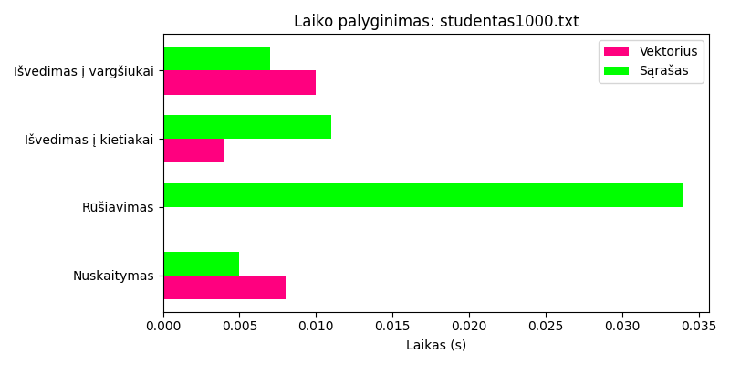
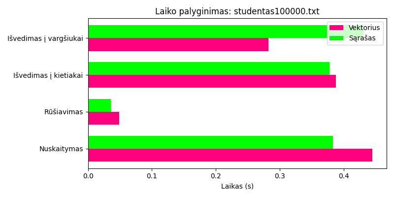
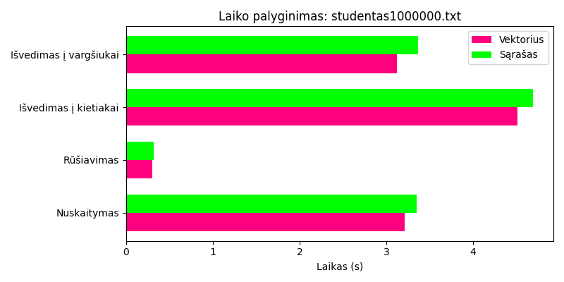
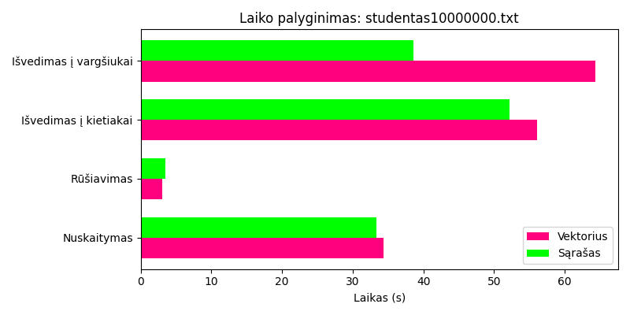

# OOP
v.01 - release
## Programos aprašymas <br/>
Programa  leidžia vartotojui suvesti arba nuskaityti duomenis apie studentą(vardą, pavardę, namų darbų rezultatus, egzamino rezultatus).<br>
Apskaičiuoja studentų galutinius rezultatus paga formulę:<br>
*Galutinis balas = 0.4 x namų darbų rezultatai + 0.6 x egzamino įvertinimas.*  <br>
Duomenų įvedimas ranka - leidžiama vartotojui pasirinkti, kiek namų darbų pažymių jis nori įvesti/sigeneruoti.
Namų darbų rezultatai - vartotojui leidžiama pasirinkti ar namų darbų rezultatus skaičiuoti su mediana ar gauti jų vidurkį.<br/>
<br/>
## Meniu 
1 - įvesti studentus <br>
2 - Nuskaityti studentus iš failo <br>
3 - Parodyti rezultatų lentelę <br>
4 - Testavimas pagal failą <br>
5 - Generuoti atsitiktinius studentų failus <br>
6 - Padalinti studentus į grupes (vargšiukai/kietiakai) <br>
7 - Baigti programą <br>

## Atnaujinimai v0.2
v0.1 failai buvo suskirstyti į keturis .cpp ir keturis .h failus. <br> 
Taip pat pridėtas atsitiktinis failų generavimas. <br>
bei studentų skirstymas grupėmis pagal jų rezultatus. <br>
## Atnaujinimai v0.3
Pridėtas pasirinkimas su kuriais vektoriais norime dirbti <br> 
Pridėta daugiau .h failų <br>
Pridėta objekto saugojimo vieta. <br>
Atlikti laiko testavimai tarp vector ir list konteinerių. <br>
## Atnaujinimai v1.0
Pridėta galimybė vartotojui pasirinkti kokią strategiją naudojo.

**Failų aprašymas:**
* main.cpp yra pagrindinis failas.
* studentas.cpp faile aprašytas studento įvedimas.
* failai.cpp faile surašyti metodai naudojami failų generavimui, nuskaitymui, įrašymui.
* meniu.cpp faile aprašytos meniu naudojamos funkcijos.
* MyLib.h faile aprašytos visos pogramoje naudojamos bibliotekos.
* studentas.h faile aprašyta Stud struktūra, kuri aprašo studentą ir metodų deklaracijos.
* Timer.h faile aprašytas laiko skaičiavimo klasė.
* meniu.h deklaruotos studentų dalijimo, rikiavimo funkcijos
* failai.h deklaruotos funkcijos failai.cpp
<a/>


## Programos spartos analizė

Laiko testavimas buvo atliktas su vektoriaus ir sąrašo konteineriais, naudoti tie patys sugeneruoti failai su 5 namų darbų pažymiais iš v0.2 versijos, laikui matuoti imtas 5 bandymų vidurkis

### Testavimo sistemos parametrai
CPU: AMD Ryzen 5 7535U with Radeon Graphics 2.90 GHz <br>
RAM: 16GB (13.7GB naudojami) <br>
HDD: SSD 512GB (SKHynix HFS512GEJ4X112N) <br>
### Laiko matavimo metodas
Buvo naudota naudota C++ biblioteka chrono
### Testuoti failai:
studentas1000.txt - 1000 studentų <br>
studentas10000.txt - 10000 studentų <br>
studentas100000.txt - 100000 studentų <br>
studentas1000000.txt - 1000000 studentų <br> 
studentas10000000.txt - 10000000 studentų <br>
#### Kodas:
```cpp
auto start = high_resolution_clock::now();
auto end = high_resolution_clock::now();
auto duration = duration_cast<milliseconds>(end - start).count();
```

## Programos spartos analizė v1.0
Laiko testavimas atliktas pagal startegijas <br>
* 1 strategija - studentai skaidomi į du naujus to paties tipo konteinerius <br>
* 2 strategija - skaidymas panaudojant tik vieną naują konteinerį: "vargšiukai" <br>
* 3 strategija - skaidymas panaudojant greičiausiai veikianti 1 arba 2 strategiją  įtraukiant į ją "efektyvius" darbo su konteineriais metodus <br>

### Rezultatai

### studentas1000.txt

| Struktūra | Strategija | Skaidymo laikas (ms) |
|:-----------|:------------:|--------------------:|
| **Vector** | 1 | 0.449 |
|            | 2 | 0.497 |
|            | 3 | 0.289 |
| **List**   | 1 | 0.617 |
|            | 2 | 0.442 |
|            | 3 | 0.233 |

---

### studentas10000.txt


| Struktūra | Strategija | Skaidymo laikas (ms) |
|:-----------|:------------:|--------------------:|
| **Vector** | 1 | 0.706 |
|            | 2 | 0.429 |
|            | 3 | 2.233 |
| **List**   | 1 | 5.132 |
|            | 2 | 3.550 |
|            | 3 | 1.461 |

---

### studentas100000.txt

| Struktūra | Strategija | Skaidymo laikas (ms) |
|:-----------|:------------:|--------------------:|
| **Vector** | 1 | 47.331 |
|            | 2 | 31.403 |
|            | 3 | 25.584 |
| **List**   | 1 | 58.420 |
|            | 2 | 31.791 |
|            | 3 | 13.71  |

### studentas1000000.txt

| Struktūra | Strategija | Skaidymo laikas (ms) |
|:-----------|:------------:|--------------------:|
| **Vector** | 1 | 532.943 |
|            | 2 | 266.509 |
|            | 3 | 246.032 |
| **List**   | 1 | 566.519 |
|            | 2 | 306.898 |
|            | 3 | 148.113 |

---

### studentas10000000.txt

| Struktūra | Strategija | Skaidymo laikas (ms) |
|:-----------|:------------:|--------------------:|
| **Vector** | 1 | 3895.486 |
|            | 2 | 3077.489 |
|            | 3 | 22349.628 |
| **List**   | 1 | 4373.569 |
|            | 2 | 3799.924 |
|            | 3 | 1749.426 |

---
## Trečios strategijos optimizavimas
Buvo pasirinkta naudoti std::stable_parition (buvo abndyta naudoti tiesiog partition, bet laikas gavosi ilgesnis), nes: <br>
naudoja mažiau atminties nei kitos kiti algoritmai <br>
jei pažymys atitinką kriterijų jis atsiduria pradžioje, jei ne nukeliamas į galą<br>

### Rezultatų palyginimas trečios startegijos prieš ir po optimizaciją

| Failas | Struktūra | Prieš optimizavimą (ms) | Su `std::stable_partition` (ms) | Su `std::partition` (ms) | Pokytis tarp `stable_partition` ir `partition` (ms) | Pokytis tarp „prieš optimizavimą“ ir `stable_partition` (ms) |
|:--------------------|:-----------|-------------------------------:|-----------------------------:|--------------------------:|----------------------------------:|-----------------------------------------------:|
| **studentas1000.txt** | Vector | 0.449 | 0.018 | 0.270 | +0.252 | −0.431 |
|  | List | 0.617 | 0.141 | 0.304 | +0.163 | −0.476 |
| **studentas10000.txt** | Vector | 0.706 | 0.024 | 0.985 | +0.961 | −0.682 |
|  | List | 5.132 | 1.022 | 3.287 | −2.265 | −4.110 |
| **studentas100000.txt** | Vector | 47.331 | 0.805 | 12.411 | +11.606 | −46.526 |
|  | List | 58.420 | 5.194 | 49.538 | +44.344 | −53.226 |
| **studentas1000000.txt** | Vector | 532.943 | 4.681 | 156.580 | +151.899 | −528.262 |
|  | List | 566.519 | 49.933 | 409.203 | +359.270 | −516.586 |
| **studentas10000000.txt** | Vector | 3895.486 | 205.997 | 1448.052 | +1242.055 | −3689.489 |
|  | List | 4373.569 | 863.912 | 3724.769 | +2860.857 | −3509.657 |
---
### Spartos analizės v1.0 išvados
* 1 bei 2 strategija veikė panašiu greičiu, bet 2 buvo greitesnė, nes naudojo tik vieną konteinerį.
* 3 strategija prieš optimizavimą dauguma aftveju efektyviausia(išskyrus dirbant su std::vector naudojant 100000 bei 10mln failus).
* Vector konteineris veikė greičiau už list.
* Stable_partition veikė efektyviau nei tiesiog partition.
* Optimizavus 3 strategija, veikimo laikas visais atvejai sutrumpėjo. Tačiau matome, kad jis labiau tinkamas vektoriams.
  

## Spartos analizė v0.3
### Testavimo kategorijos
1 Failų kūrimas <br>
2 Duomenų nuskaitymas iš failų <br>
3 Studentų rūšiavimas į dvi grupes <br>
4 Surūšiuotų studentų išvedimas į vargšiukai.txt <br>
5 Surūšiuotų studentų išvedimas į kietiakai.txt <br>
### Rezultatų lentelė
### Testavimas su vektoriaus konteineriu

| Failas                 | Failo kūrimas | Duomenų nuskaitymas | Studentų rūšiavimas | Išvedimas į kietiakai |Išvedimas į vargšiukai|
|:------------------------|:--------------|:--------------------|:--------------------|:-------------------|:-------------------|
| studentas1000.txt       | 5.4 s         | 0.008 s             | 0 s                 | 0.004 s            | 0.01 s             |
| studentas10000.txt      | 4.9 s         | 0.048 s             | 0.003 s             | 0.048 s            | 0.044 s            |
| studentas100000.txt     | 7.1 s         | 0.445 s             | 0.049 s             | 0.388 s            | 0.282 s            |
| studentas1000000.txt    | 16.7 s        | 3.21 s              | 0.304 s             | 4.51 s             | 3.12 s             |
| studentas10000000.txt   | 111.6 s       | 34.3 s              | 3.1 s               | 56.12 s            | 64.33 s            |

### Testavimas su sąrašo konteineriu

| Failas                 | Failo kūrimas | Duomenų nuskaitymas | Studentų rūšiavimas | Išvedimas į kietiakai |Išvedimas į vargšiukai|
|:------------------------|:--------------|:--------------------|:--------------------|:-------------------|:-------------------|
| studentas1000.txt       | 5.4s          | 0.005 s             | 0.00064s            | 0.011 s            | 0.007 s            |
| studentas10000.txt      | 4.9 s         | 0.076 s             | 0.003 s             | 0.053 s            | 0.042 s            |
| studentas100000.txt     | 7.1 s         | 0.383 s             | 0.036 s             | 0.378 s            | 0.431 s            |
| studentas1000000.txt    | 16.7 s        | 3.35 s              | 0.319 s             | 4.69 s             | 3.369 s            |
| studentas10000000.txt   | 111.6 s       | 33.3 s              | 3.5 s               | 52.13 s            | 38.62 s            |


## Rezultatų diagramos

### studentas1000.txt


---

### studentas10000.txt


---

### studentas100000.txt


---

### studentas1000000.txt


---

### studentas10000000.txt


---

## Spartos analizės išvados:
Buvo testuojama programa naudojant dvi skirtingas struktūras: std::vector ir std::list. Programos veikimo laikai buvo lyginami. </br>
**Galima padaryti išvadas:**
* Lyginant vector ir list labai didelių skirtumų nėra
* Atsižvelgiant į 10mln failą, sąrašas yra labiau tinkamas naudoti su dideliais duomenų kiekiais, priešingai negu vector, kuris geriau veikia mažesnio duomenų kiekio failuose.
* Iš gautų rezultatų matome, kad su skirtingais duomenų kiekiais programos vykdymo laikai kito, todėl sudėtinga padaryti vienareikšmę išvadą, kuris konteinerio tipas: vektorius ar sąrašas, yra tinkamesnis failų nuskaitymui, išvedimui ar rūšiavimui.
* Reiktų bandyti atlikti tyrimą su daugiau bandymų, kad gautume tikslesnius rezultatus.
